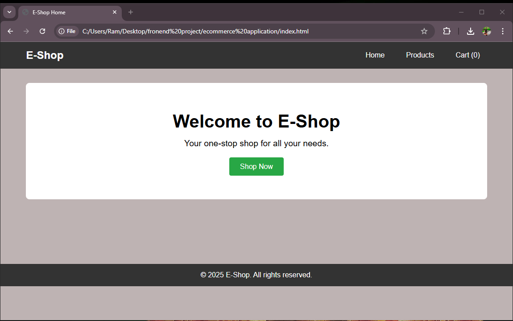
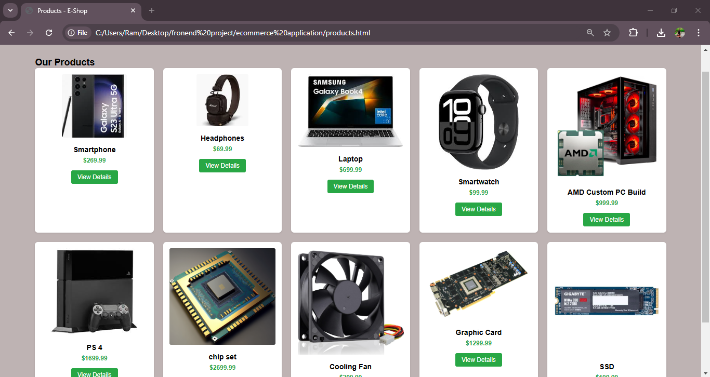
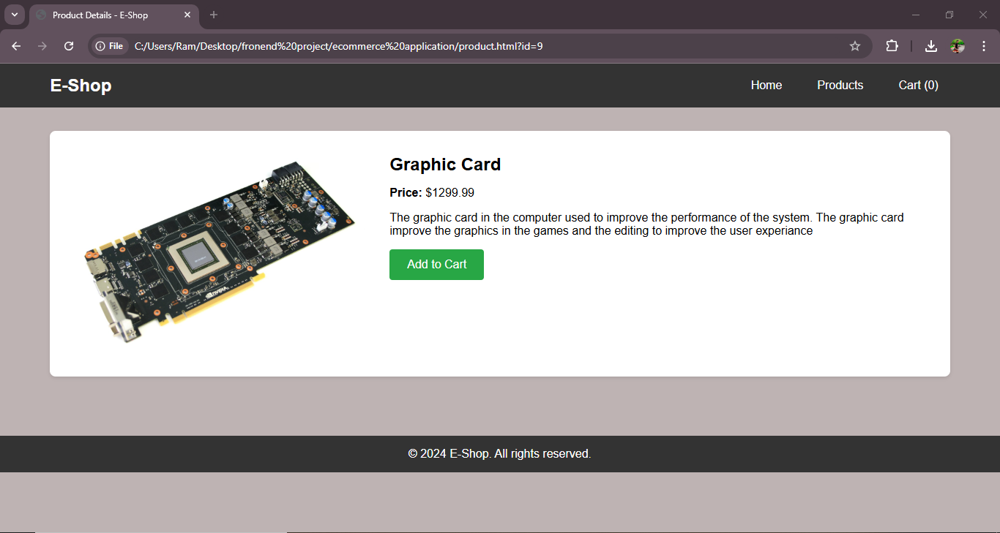
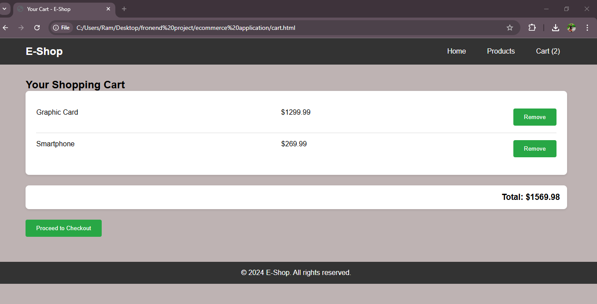

<h1>
  e-commerce application
</h1>
<h3>
  Summary
</h3>

  I created an e-commerce application utilizing HTML, CSS, and JavaScript to provide a seamless shopping experience. The platform features a clean, responsive design, ensuring compatibility across various devices. Users can explore a wide range of products categorized for easy navigation. Each product includes details such as name, price, and an image, along with an "Add to Cart" button.

The shopping cart dynamically updates as users add or remove items, reflecting the total price in real-time. JavaScript plays a crucial role in managing user interactions, such as handling form validations during checkout and implementing interactive elements like search filters and sorting options. CSS enhances the visual appeal, offering a modern and professional look.

This application demonstrates my ability to integrate front-end technologies to create a functional and visually appealing platform, laying the groundwork for a scalable e-commerce solution.

<h4>
  The user interface be like the:-
</h4>

<h4>
  The product are displayed:-
</h4>

<h4>
  The detailes of the product can be displayed as:-
</h4>

<h4>
  The totel cart is displayed like the all the products and the value of the products:-
</h4>

